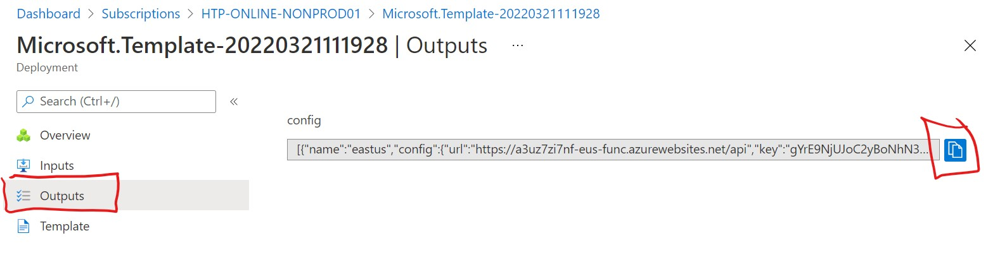
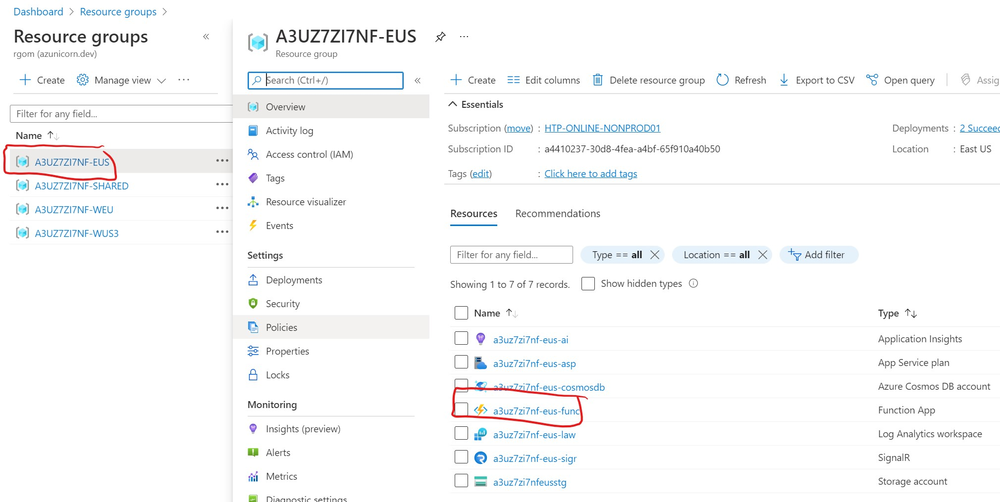
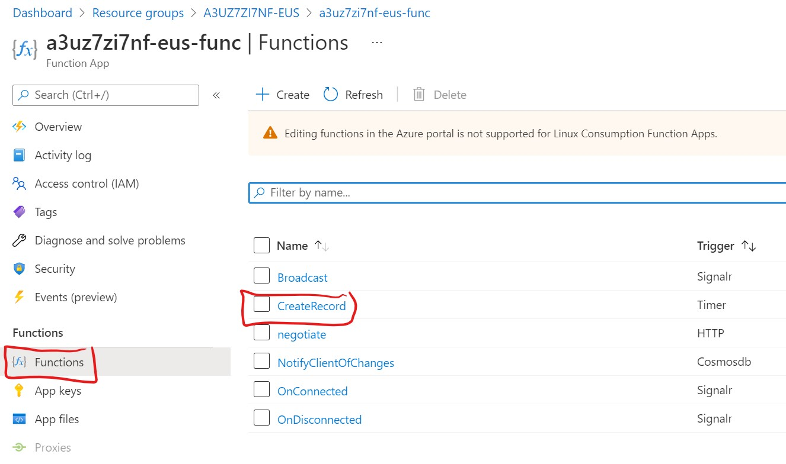
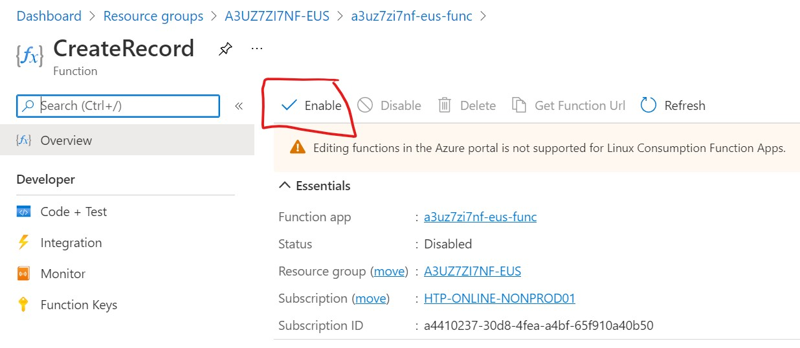

# Cosmos Multi Region

This repository demonstrates how to deploy a mult-region Cosmos DB account with local change feed processing via Azure Functions within each region.

## Setup

Deploy the Azure infrastructure by clicking the the "Deploy to Azure" button below. You may visualize the deployment by clicking the "Visualize" button to better understand exactly what will be deployed.

[](https://portal.azure.com/#create/Microsoft.Template/uri/)
[](http://armviz.io/#/?load=)

When the template deployment is complete (~10 minutes), copy the `config` output from the deployment and replace the comment placeholder in the `./src/MultiRegion/MultiRegion.Client/appsettings.json` file:



```json
{
	"SignalR": // Replace this comment with Azure IaC deployment config output value.
}
```

Install the latest .NET SDK if not already present on your system:

[https://dotnet.microsoft.com/en-us/download](https://dotnet.microsoft.com/en-us/download)

## Usage

The Azure Functions app deployed in each region have a Timer trigger function named `CreateRecord` which creates a new record in the globally replicated Comsos DB account. This function is disabled by default and can be enabled using the following steps:

1. Navigate to your Azure Function App within one of the regional resource groups


2. Navigate to the Functions section of the Azure Functions App and select the `CreateRecord` function


3. Click Enable


4. Build and run the client by executing the following command from the root of the repository: `dotnet run --project ./src/MultiRegion/MultiRegion.Client/MultiRegion.Client.csproj`

## License

The MIT License (MIT)

Copyright © 2020 Ryan Graham

Permission is hereby granted, free of charge, to any person obtaining a copy of this software and associated documentation files (the “Software”), to deal in the Software without restriction, including without limitation the rights to use, copy, modify, merge, publish, distribute, sublicense, and/or sell copies of the Software, and to permit persons to whom the Software is furnished to do so, subject to the following conditions:

The above copyright notice and this permission notice shall be included in all copies or substantial portions of the Software.

THE SOFTWARE IS PROVIDED “AS IS”, WITHOUT WARRANTY OF ANY KIND, EXPRESS OR IMPLIED, INCLUDING BUT NOT LIMITED TO THE WARRANTIES OF MERCHANTABILITY, FITNESS FOR A PARTICULAR PURPOSE AND NONINFRINGEMENT. IN NO EVENT SHALL THE AUTHORS OR COPYRIGHT HOLDERS BE LIABLE FOR ANY CLAIM, DAMAGES OR OTHER LIABILITY, WHETHER IN AN ACTION OF CONTRACT, TORT OR OTHERWISE, ARISING FROM, OUT OF OR IN CONNECTION WITH THE SOFTWARE OR THE USE OR OTHER DEALINGS IN THE SOFTWARE.